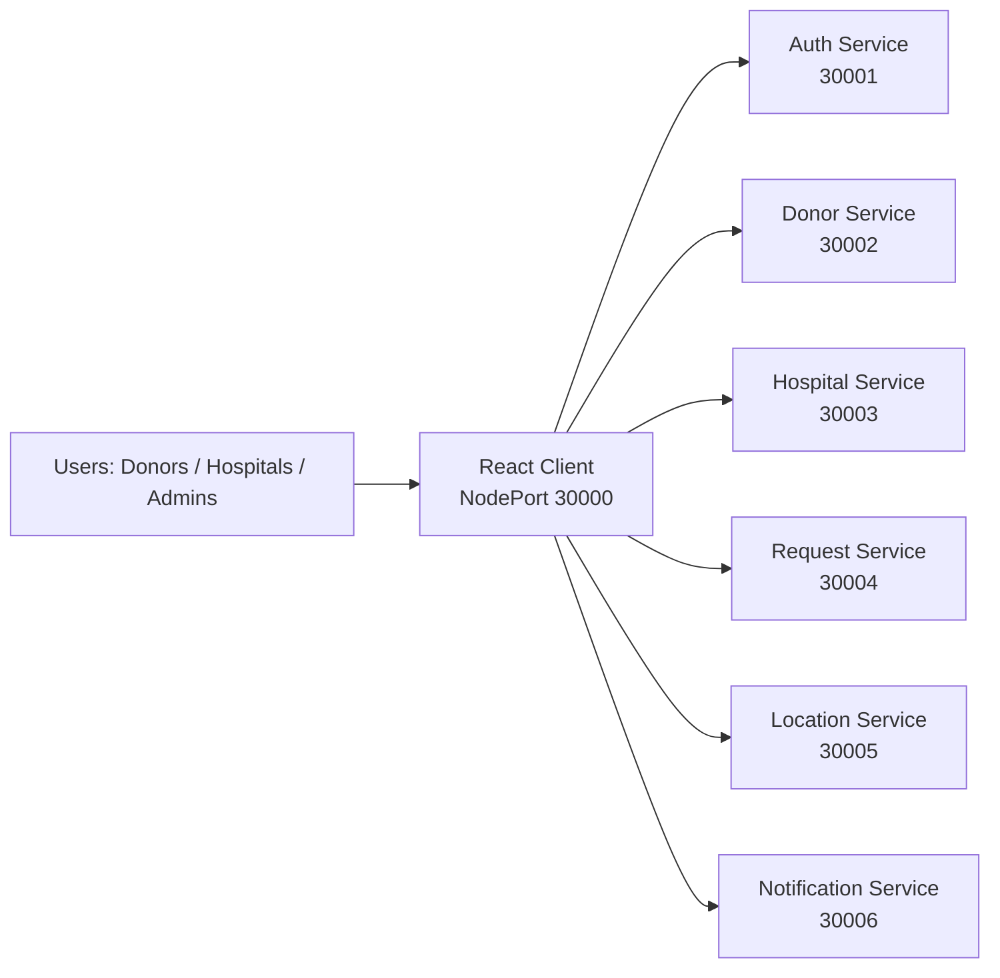
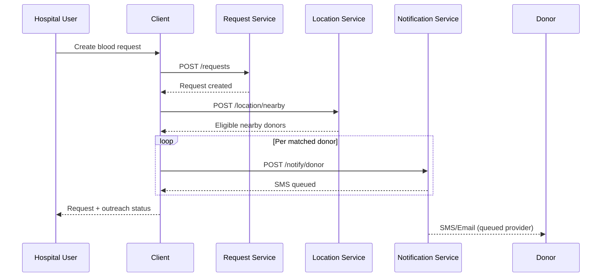
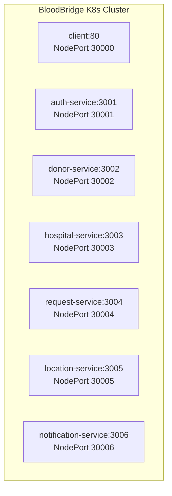

# BloodBridge SOA

> Service-oriented platform for coordinating blood donation workflows between donors and hospitals.

[](#)
[](#)
[](#)
[](./LICENSE)

## Table of Contents

- [Overview](#overview)
- [Architecture](#architecture)
- [Technology Stack](#technology-stack)
- [Repository Structure](#repository-structure)
- [Services](#services)
- [Getting Started](#getting-started)
- [Running with Docker](#running-with-docker)
- [Kubernetes Deployment](#kubernetes-deployment)
- [Testing and Quality](#testing-and-quality)
- [API Quick Reference](#api-quick-reference)
- [Contributing](#contributing)
- [License](#license)

## Overview

BloodBridge is a microservices-based system where:

- **Hospitals** publish blood requests.
- **Donors** can be discovered by blood type and location.
- **Notification workflows** queue SMS/email communications.
- **Auth** secures user sessions with JWT.

The current implementation is optimized for development and learning, with in-memory storage across services.

## Architecture

### 1) System Context



### 2) Core Request Flow (Hospital request to donor notification)



### 3) Deployment View (Kubernetes NodePort)



## Technology Stack

- **Frontend:** React 19, Vite, React Router, Axios, Tailwind CSS
- **Backend:** Node.js, Express.js, Swagger UI
- **Testing:** Jest (services), Vitest (client)
- **Security Middleware:** Helmet, CORS
- **Packaging/Deploy:** Docker, Kubernetes NodePort manifests

## Repository Structure

```text
bloodbridge-soa/
├── client/                         # React frontend
├── services/
│   ├── auth-service/
│   ├── donor-service/
│   ├── hospital-service/
│   ├── request-service/
│   ├── location-service/
│   └── notification-service/
├── k8s/                            # Kubernetes manifests
├── infra/                          # Infrastructure automation assets
├── test-all.sh                     # Runs all service + client tests
├── DESIGN.md                       # Frontend/product design notes
└── README.md
```

## Services

| Service | Internal Port | NodePort | Responsibility |
|---|---:|---:|---|
| Auth Service | 3001 | 30001 | Register, login, JWT verification |
| Donor Service | 3002 | 30002 | Donor CRUD and availability |
| Hospital Service | 3003 | 30003 | Hospital CRUD |
| Request Service | 3004 | 30004 | Blood request lifecycle |
| Location Service | 3005 | 30005 | Nearby donor lookup and distance calculation |
| Notification Service | 3006 | 30006 | SMS/email queueing and history |
| Client | 80 | 30000 | Web UI for all user roles |

## Getting Started

### Prerequisites

- Node.js 18+
- npm 9+

### 1) Clone

```bash
git clone https://github.com/mahitoh/bloodbridge-soa.git
cd bloodbridge-soa
```

### 2) Install dependencies

```bash
npm install
cd client && npm install && cd ..
cd services/auth-service && npm install && cd ../..
cd services/donor-service && npm install && cd ../..
cd services/hospital-service && npm install && cd ../..
cd services/request-service && npm install && cd ../..
cd services/location-service && npm install && cd ../..
cd services/notification-service && npm install && cd ../..
```

### 3) Configure environment

Copy each service `.env.example` to `.env` and adjust values if needed:

- `services/auth-service/.env`
- `services/donor-service/.env`
- `services/hospital-service/.env`
- `services/request-service/.env`
- `services/location-service/.env`
- `services/notification-service/.env`

### 4) Run services (separate terminals)

```bash
cd services/auth-service && npm start
cd services/donor-service && npm start
cd services/hospital-service && npm start
cd services/request-service && npm start
cd services/location-service && npm start
cd services/notification-service && npm start
```

### 5) Run client

```bash
cd client
npm run dev
```

## Running with Docker

Each component includes a Dockerfile.

Example:

```bash
docker build -t bloodbridge-auth ./services/auth-service
docker build -t bloodbridge-donor ./services/donor-service
docker build -t bloodbridge-hospital ./services/hospital-service
docker build -t bloodbridge-request ./services/request-service
docker build -t bloodbridge-location ./services/location-service
docker build -t bloodbridge-notification ./services/notification-service
docker build -t bloodbridge-client ./client
```

## Kubernetes Deployment

Apply manifests from the repository root:

```bash
kubectl apply -f k8s/auth-service.yaml
kubectl apply -f k8s/donor-service.yaml
kubectl apply -f k8s/hospital-service.yaml
kubectl apply -f k8s/request-service.yaml
kubectl apply -f k8s/location-service.yaml
kubectl apply -f k8s/notification-service.yaml
kubectl apply -f k8s/client.yaml
```

## Testing and Quality

### Run all tests

```bash
./test-all.sh
```

### Run frontend lint/build

```bash
cd client
npm run lint
npm run build
```

## API Quick Reference

All services expose:

- `GET /health`
- `GET /api-docs` (Swagger UI)

Key business routes:

- **Auth:** `POST /auth/register`, `POST /auth/login`, `POST /auth/verify`
- **Donors:** `GET /donors`, `POST /donors`, `GET /donors/:id`, `PUT /donors/:id/availability`
- **Hospitals:** `GET /hospitals`, `POST /hospitals`, `GET /hospitals/:id`, `PUT /hospitals/:id`
- **Requests:** `GET /requests`, `POST /requests`, `GET /requests/:id`, `PUT /requests/:id/status`
- **Location:** `POST /location/nearby`, `POST /location/distance`
- **Notifications:** `POST /notify/sms`, `POST /notify/email`, `POST /notify/donor`, `POST /notify/hospital`, `GET /notify/history`, `GET /notify/history/:id`

## Contributing

Contributions are welcome.

1. Fork the repository
2. Create a feature branch
3. Commit your changes
4. Open a pull request

## License

This project is licensed under the [MIT License](./LICENSE).
r